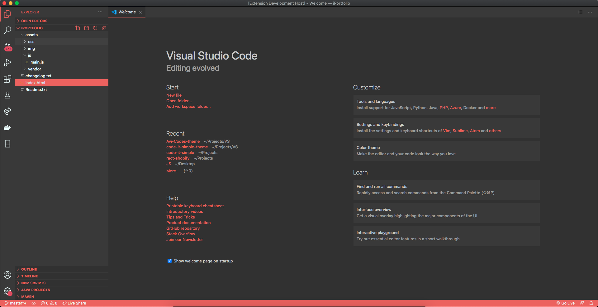
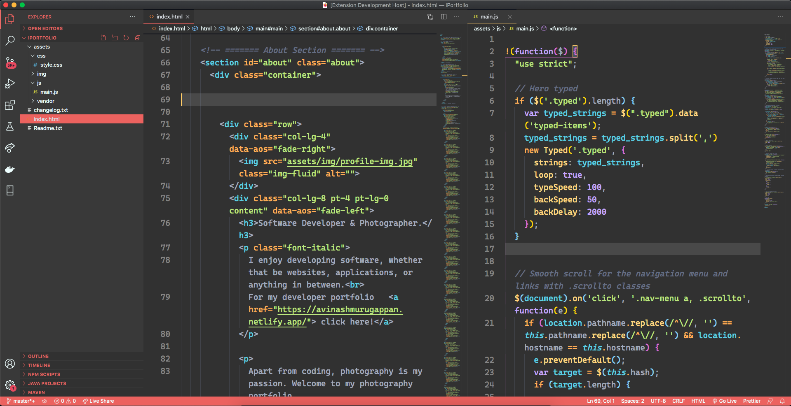

  

<h1 align="center">
 Avi Codes Theme for VS Code
</h1>
<h5 align="center">A minimal, mordern theme for VS Code created for you, by <a href="https://www.instagram.com/avi_codes">@avi_codes</a> | <a href="https://marketplace.visualstudio.com/items?itemName=AvinashM.Avi-Codes-theme"> Clicke here </a> to view it in VS Code marketplace.</h5>

  
  
  

## Installation via VS Code

1. Open **Extensions** sidebar panel in VS Code. `View → Extensions`
2. Search for `Avi Codes Theme`
3. Click **Install** to install it
4. Click **Reload** to reload the editor
5. Code > Preferences > Color Theme > **Avi Codes Theme**
